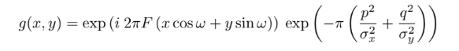
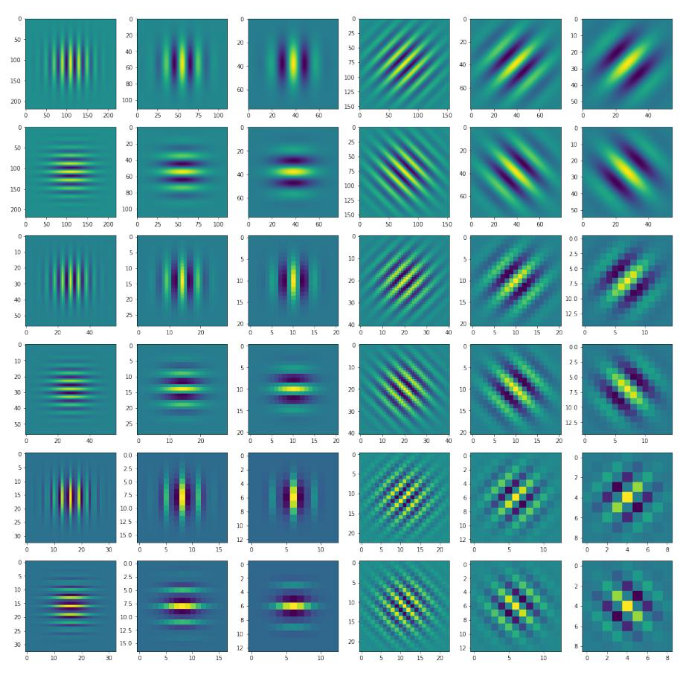
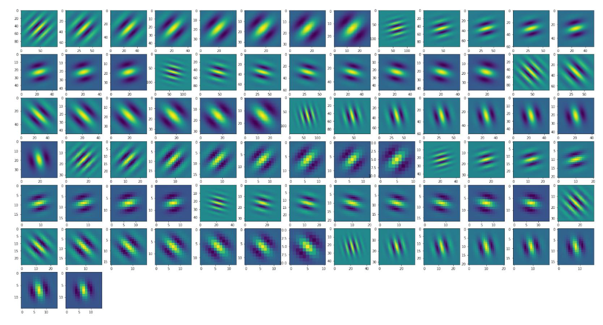
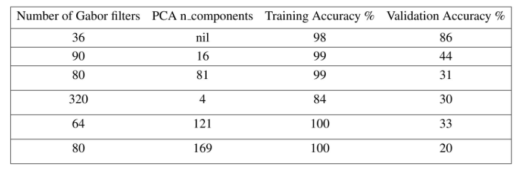

# Gabor-Filters-and-SVM-on-MNIST
This is the solution to the question given in SVM_Gabor_Question.pdf.
## Support Vector Machines
Support Vector Machines are used to recognize digits from the MNIST dataset, given multiple constraints. I used gridsearch to find the best hyperparameter C for the SVM function.

## Gabor Filter Banks
The Gabor filter, named after Dennis Gabor, is a linear filter used in myriad of image processing application for edge detection, texture analysis, feature extraction, etc. A Gabor filter can be viewed as a sinusoidal signal of particular frequency and orientation, modulated by a Gaussian wave.

More about Gabor Filters can be found here - [Through The Eyes of Gabor Filter](https://medium.com/@anuj_shah/through-the-eyes-of-gabor-filter-17d1fdb3ac97)

The MNIST images are convolved with the following Gabor Filter. 

A filter bank of 36 filters is created with multiple gabor filters created with different rotations and scales.Instead of considering the pixel intensities of the MNIST images as the features for training the SVM, the co-efficients of the Gabor filter-bank will be used to train the SVM.

The filter bank was generated as shown.

The filter bank with increased number of Gabor filters

The training and validation accuracy on MNIST dataset with different PCA dimensions and different number of Gabor filter banks are as follows:

